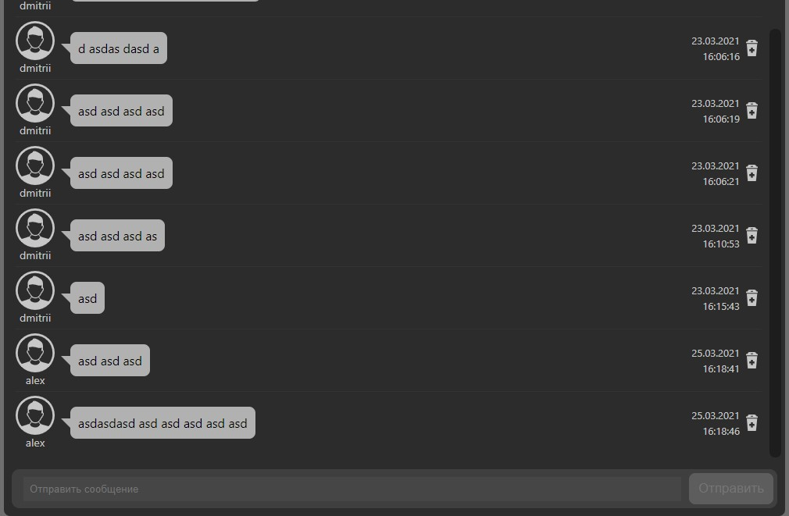

## Автор
- Miasnikov Dmitrii
- email: miasnikovdmitrii@gmail.com

## Описание
сайт Чатов

## Используемые технологии
- Проект написан на TypeScript, React, Redux с применением Hooks, ES6, Styled-components
- Используется База данных MongoDB
- api написано на node express лежит в отдельном репозитории https://github.com/DmitriiMiasnikov/chat_api

## Функциональные возможности
- Реализована Регистрация и Авторизация
- Авторизованные пользователи могут создавать новые чаты и оставлять сообщения
- Чаты можно переименовывать и удалять
- Сообщения можно только удалять, редактирование пока не сделал

## Запуск
```npm run start```

## Скриншоты
[](скриншот)
[](скриншот)
[](скриншот)